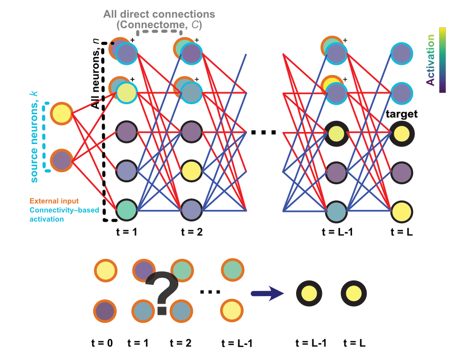

Activation maximisation 
========================

There are now models of the connectome (e.g. `Shiu et al. 2023 <https://pubmed.ncbi.nlm.nih.gov/37205514/>`_ or :doc:`our implementation<simple_model>`). But what stimulus should you give to activate your neurons of interest? 

If you didn't know anything about the target neuron(s) *a priori*, it can be hard to answer this question without searching through all possible stimuli. But even assuming each input neuron only has two states (on/off), with (say) 500 input neurons, it still means :math:`2^{500}` combinations to try. We don't want to do this. 

Fortunately, there is already a technique in explainable AI research that addresses this problem: **activation maximisation**. Very cool blogs in this field: `Olah et al. 2017 <https://distill.pub/2017/feature-visualization/>`_, `Olah et al. 2018 <https://distill.pub/2018/building-blocks/>`_, and `Goh et al. 2021 <https://distill.pub/2021/multimodal-neurons/>`_. 

Our model of the connectome uses the "multi-layer perceptron" architecture in machine learning. This makes it possible to apply this technique, which uses `gradient descent` to search for the *optimal* stimulus for each neuron. 

This illustration follows the one in the :doc:`model implementation<simple_model>`. Additionally, the fill colour of each circle indicates the activation of the neuron. As illustrated in the lower panel, the goal is to find the optimal input pattern that maximally activates the target neuron(s) at the specified timepoints. 

Gradient descent 
-----------------
There are many blogs/articles online explaining this, but briefly, it's like you are lost in a mountain, and you are trying to find the lowest point possible in the landscape (the foot of the mountain). To get there, for every step you take, you look around, and go towards the direction that takes you lower than your previous step. If you keep doing this, you will end up at *a* foot of the mountain.

Loss function 
--------------
What are we optimising for? The activation of the target neuron(s), you say. 

But we want more than that. To make the results as interpretable as possible, we want as few as possible (input and non-input) neurons activated, while the target neuron(s) are activated, to extract a *minimal* circuit for maximal activation. So the loss function (what we are trying to minimise, the distance from the foot of the mountain) is: 

.. math::
    
    \text{Loss} = -\ell_{\text{act}} + \ell_{\text{de-act}} + \ell_{\text{in-reg}} + \ell_{\text{out-reg}}

where :math:`\ell_{\text{act}}` is the activation loss, :math:`\ell_{\text{de-act}}` the de-activation loss, :math:`\ell_{\text{in-reg}}` the input regularisation loss (the general activation of input neurons), and :math:`\ell_{\text{out-reg}}` the non-input regularisation loss (the general activation of non-input neurons). 

Getting fancy 
--------------
Using `TargetActivation`, you can specify the target activation by batch, timepoint, neuron index, and activation value. This means you can mix and match neurons you wish to (de)activate at each timestep. Some interesting questions include: 

- What's the *difference* in the optimal stimuli between two sets of neurons? 
- What's the best stimuli pattern for a time-varying *pattern* of target neuron activation? 

Have fun! 