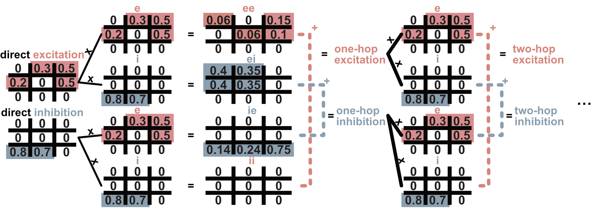

Excitatory/Inhibitory "effective connectivity"
==============================================
The :doc:`path compression method<matmul>` quantifies the influence one neuron has on another, but does not account for the sign of the connections. Using predicted neurotransmitter information (`Eckstein et al. 2024 <https://www.sciencedirect.com/science/article/pii/S0092867424003076?via%3Dihub>`_), we present a method to calculate the excitatory/inhibitory influence. 

We assume that an even number of inhibitory steps in the path is somewhat equivalent to excitation. This is again a common neuroscience conceptualisation: two inhibitory steps are together termed ‘**disinhibition**’, which in principle only fails to excite the target neuron if the intermediary neuron is not active in the first place (the inhibition from the source therefore has no effect). 

**Naively**, calculating excitatory/inhibitory influence of path length `n` requires: 

1. enumerating all possible combinations of excitatory/inhibitory steps (e.g. for path length 3, there are :math:`2^3` combinations: e-e-e, e-e-i, e-i-e...); 
2. counting inhibitory steps, and 
3. summing paths with an even number of inhibitory steps. 

This approach is memory-intensive, and the number of possible combinations grows exponentially with path length.

   Figure 1. Calculation of excitatory/inhibitory connectivity. Presynaptic neurons are in the rows. Suppose the first two are excitatory (red). Excitation one hop away consists of excitatory-excitatory paths and inhibitory-inhibitory paths (i.e. disinhibition). Similarly, inhibition one hop away consists of excitatory-inhibitory and inhibitory-excitatory paths. The resulting effective excitation and inhibition matrix can be used to calculate the next excitatory/inhibitory step. 

**Our method** avoids this by summarizing 'effective excitation' and 'effective inhibition' at each step. The connectivity matrix (presynaptic neurons in rows, postsynaptic neurons in columns) is split into excitatory and inhibitory parts based on the presynaptic neuron's neurotransmitter type (Figure 1).

To calculate the weights through two steps of excitation, the matrix with excitatory output rows is multiplied by the matrix with excitatory input columns. The total excitation is the sum of excitatory-excitatory and inhibitory-inhibitory paths. The total inhibition is the sum of excitatory-inhibitory and inhibitory-excitatory paths. These new matrices are then used for subsequent steps of matrix multiplication.
