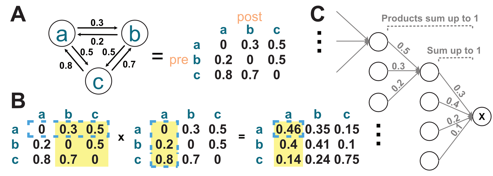
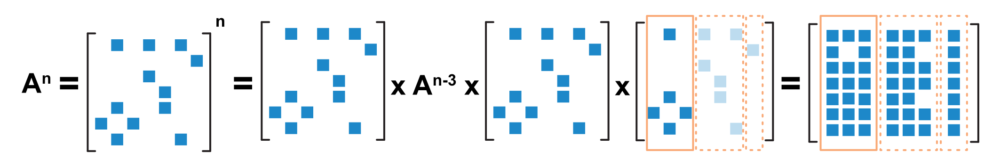
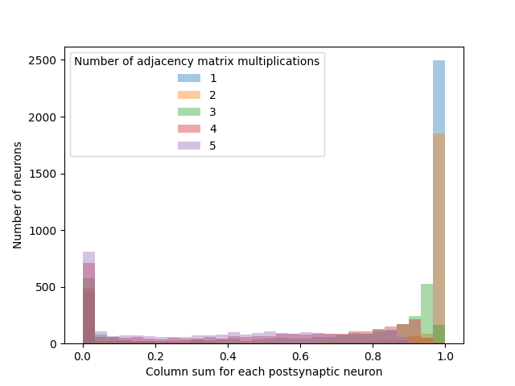
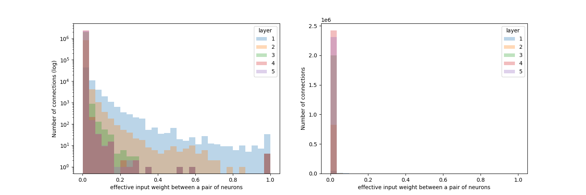
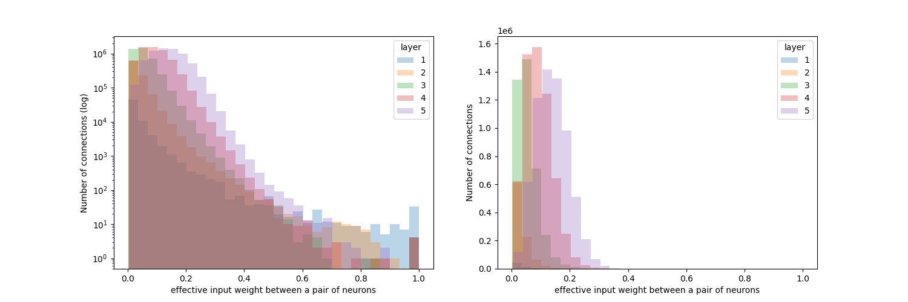

Paths compression / "effective connectivity" calculation
=========================================================

All upstream partners of a neuron, by definition, occupy 100% of that neuron’s input. Each upstream partner has its own upstream partners, which also contribute 100% to their input. 

We can, therefore, calculate the contribution from neurons two hops upstream to the target neuron (Figure 1C). For example, for the following path: :math:`A\xrightarrow[]{0.4}B\xrightarrow[]{0.6} C` (i.e. A's input occupies 40% of B’s input; and B occupies 60% of C’s input), A’s contribution to C is :math:`0.4\times0.6 = 0.24`. 

   Figure 1. Paths compression. 

   **A.** Demonstrating the equivalence of two ways of representing the connectivity in a toy circuit. 

   **B.** Effective connectivity as matrix multiplication: for instance, the connectivity from :math:`a` to :math:`a`, two hops away (blue outline), is calculated as follows: :math:`0\times0 + 0.3\times0.2 + 0.5\times0.8 = 0.46`. 
   
   :math:`a` reaches :math:`a` through :math:`b` and :math:`c`. The amount of influence :math:`a` has on :math:`a`, one hop away, is a product of the source :math:`a`'s output (first matrix, row), and the target `a`'s input (second matrix, column). 
   
   Another way to look at this: :math:`a`'s connectivity from :math:`a`, :math:`b` and :math:`c`, two hops away, could be understood as follows: 0.2 of :math:`a`'s direct input is from :math:`b`, and 0.8 from :math:`c`. :math:`a`'s one-hop connectivity is therefore: :math:`0.2\times \text{column}_b + 0.8\times \text{column}_c`. This corresponds to the 'column picture' of matrix multiplication. 
   
   **C.** An alternative schematic focusing on one target neuron (i.e. one column in the resulting matrix).

The calculation of effective connectivity is therefore implemented via matrix multiplications: as illustrated in Figure 1A and 1B, calculating connectivity two hops away, from all neurons to all neurons, is equivalent to multiplying the adjacency matrix (where each column sums to 1) by itself once, similar to a Markov chain.

Implementation 
--------------
We showed above that calculating all-to-all indirect connectivity can be done with matrix multiplications. We also explained :doc:`here<../your_own_data>` why sparse matrices should be used to reduce memory consumption. 

This is however not enough: the vast divergence and convergence in the nervous system hints towards the fact that the sparse matrix quickly becomes dense as it's multiplied with itself, again consuming more memory than we can afford. 

We address this problem here with chunking: 

   Figure 2. 

   We split the last matrix to be multiplied into column chunks (orange boxes). Each chunk is a dense matrix. The chunk is then multiplied with all previous sparse full matrices, resulting in a dense matrix the same size as the chunk. This is repeated for all chunks. Thresholding is optional for both during matrix multiplication and when saving the results. 

This way, the memory consumption is the size of the sparse all-to-all connectivity matrix (generally a few hundred MB), and a few times the size of one chunk, whose size is chosen by the user. 

Since matrix multiplication works better on GPUs, this function is a lot faster on GPU, but runs on CPU too. 

Glitches 
--------
`colsum<=1`: 
++++++++++++
In theory, since all neurons directly upstream occupy 100% of the target neuron’s input, all neurons *exactly* one hop away should also occupy 100% (Figure 1C). Therefore, to get a simplified measure of the influence from neuron A to neuron B *within*, e.g., 5 hops, you can sum the results of multiple matrix multiplications. This value would be less than 5, and B's input from *all* neurons would :math:`= 5`.
To show this:

.. code-block:: python

   import numpy as np

   # Define the size of the matrix
   n = 5  # You can change this to any desired size

   # Generate a random matrix with values between 0 and 1
   matrix = np.random.rand(n, n)

   # Normalize the columns to sum to 1
   matrix = matrix / matrix.sum(axis=0)
   matrix

.. code-block:: python

   # you get e.g. 
   > array([[0.12637487, 0.09282855, 0.22877125, 0.10338055, 0.38200873],
       [0.20048119, 0.25219522, 0.21829739, 0.07612923, 0.05527061],
       [0.20128841, 0.26499372, 0.21952733, 0.1025118 , 0.3651178 ],
       [0.23524778, 0.25096706, 0.19189627, 0.35302955, 0.04821095],
       [0.23660774, 0.13901546, 0.14150776, 0.36494887, 0.14939192]])

.. code-block:: python

   (matrix @ matrix @ matrix).sum(axis = 0)

.. code-block:: python

   > array([1., 1., 1., 1., 1.])

However, some sensory neurons have no upstream partners. This means that some paths cannot be further extended upstream. The sum of inputs exactly `n` steps away is therefore :math:`\leq 1`. For instance, using the larval connectome from `Winding et al. 2023 <https://www.science.org/doi/10.1126/science.add9330>`_ (`code here <https://colab.research.google.com/drive/1VIMNFBp7dCgN5XOQ9vvzPaqb80BGPZx4#scrollTo=d6bI-DCarpsk&line=1&uniqifier=1>`_): 

   Figure 3. Column sum <= 1.

Small numbers: 
++++++++++++++
When calculating this effective input proportion, one is essentially multiplying numbers between 0 and 1, which is bound to return a smaller number the more multiplications take place. (This is not why the column sums decrease however. The connectivity matrix of the connectome is sparse. With matrix multiplications, the resulting matrix becomes increasingly dense.) Again illustrated using the larval connectome (`code here (scroll downwards a little) <https://colab.research.google.com/drive/1VIMNFBp7dCgN5XOQ9vvzPaqb80BGPZx4#scrollTo=HtRD16HkexyV&line=14&uniqifier=1>`_): 

   Figure 4. Values of effective connectivity gets smaller with more matrix multiplications. 

Given the vast amount of convergence and divergence in the connectome, it is reasonable for neurons further away to have a smaller influence (i.e. one neuron can be influenced by many neurons when the path length is long), but it can make the number hard to interpret.

An alternative implementation is to **`n`-root the products** after `n` matrix multiplications. In the example of :math:`A\xrightarrow[]{0.4}B\xrightarrow[]{0.6} C`, the influence from A to C is :math:`\sqrt{0.4 \times 0.6} = 0.49`, which can be thought of as *"the equivalent direct connection strength in a path between A and C, where there is only one neuron in each layer"*, instead of *"A’s relative contribution among all other upstream partners exactly two steps away from C"*. 

Since there is much convergence and divergence, a neuron can reach another through multiple neurons in the middle. The equivalent connection strength for "where there is only one neuron in the middle" can therefore be big. So n-rooting longer paths results in bigger connection strengths. As illustrated by the larval connectome (`code <https://colab.research.google.com/drive/1VIMNFBp7dCgN5XOQ9vvzPaqb80BGPZx4#scrollTo=91UbTiqEgCg8&line=5&uniqifier=1>`_): 

   Figure 5. Values of *rooted* effective connectivity gets bigger with more matrix multiplications. 

Whether the original or the `n`-rooted number is used (`compress_paths(root=True)`) depends on the specific needs of the user. The original gives a rough estimate of the connection strength *among other neurons* the same distance away from the target neuron; and the `n`-rooted number is perhaps more informative in the cross-path-length comparisons.
