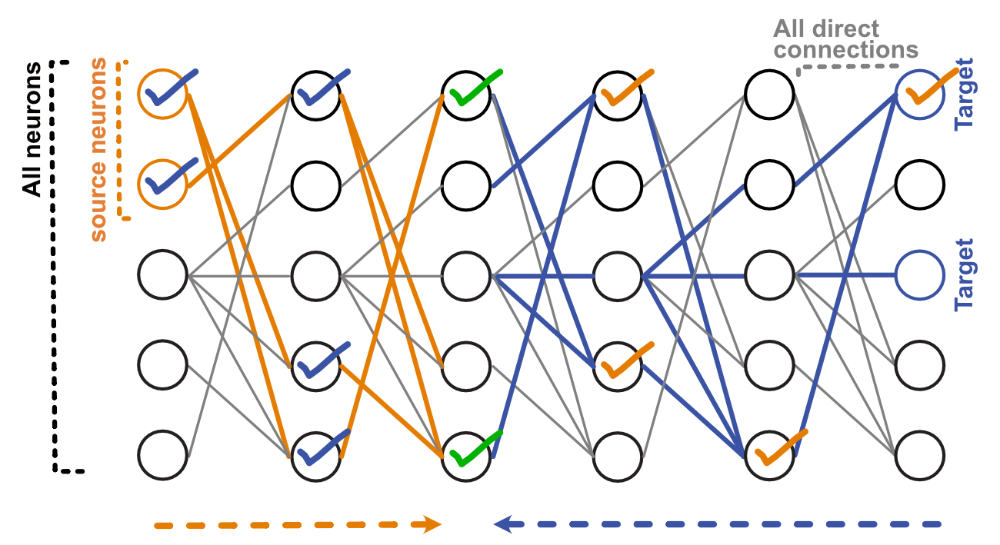
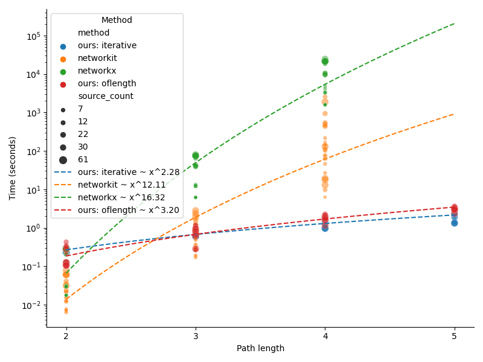

Path finding 
============

After calculating the overall influence from source neurons to target neurons, the next natural question is: *what are the paths between them?*

First, we need to determine the **distances** from which source neurons exert their influence. The :py:func:`conn_by_path_length` function answers this, with :py:func:`conn_by_path_length_heatmap` providing a heatmap visualization.

Once significant path lengths are identified, the :py:func:`find_paths_of_length` function locates intermediate neurons between source and target neurons (**Figure 1**) with a simple bidirectional breadth-first search. 

The :py:func:`find_paths_of_length` function returns a dataframe of edges, which can be

1. grouped with :py:func:`group_paths` and 
2. filtered using :py:func:`filter_paths` based on thresholds or necessary intermediate neurons, and 
3. plotted with :py:func:`plot_paths` (optionally interactively), or in neuroglancer, with :py:func:`path_for_ngl`. 

   Figure 1. Path finding. To find paths between source and target neurons `n` steps away, we find downstream neurons from source neurons (orange edges), and upstream neurons from target neurons (blue edges) - they meet at a middle layer on some neurons (green ticks). They are selected. This selection is then propagated back upstream (blue ticks) and downstream (orange ticks) to the source and target neurons. All neurons with ticks are selected. 

"These are not the paths, but a collection of intermediate nodes!" you say. We think that the list of intermediate nodes is actually what most people want most of the time, but **if you wanted the paths listed explicitly** (like `[A->B->C, A->D->C]`), then you can enumerate them with :py:func:`enumerate_paths`. 

Layers: 
++++++++
The method above gives you an edgelist of a particular path length. To get a more complete (likely messy) picture, you can get e.g. all edges *within* `n` steps using :py:func:`el_within_n_steps`, and then get the *continuous* layer number local to these edges, using the Information Flow algorithm from `Schlegel et al. 2021 <https://elifesciences.org/articles/66018>`_, integrated from `navis <https://navis-org.github.io/navis/>`_. 

Recurrence
+++++++++++
Recurrence in this case is unfolded: e.g. you'd have `A->B->A` as a path with `length = 2`. To remove some neurons (e.g. ones involved in recurrence), just remove the corresponding rows from the paths dataframe, and then use :py:func:`remove_excess_neurons` to remove the then-reduntant edges. However generally, removing recurrence is arguably hard, because the same edge can participate in both recurrent and non-recurrent connections. 

Modelling 
++++++++++
There are multiple functions that build on the paths, to facilitate looking into the :doc:`model<simple_model>`. You can: 

- start with the external input & neuron activations, to extract the "paths that matter" with connectivity and activity threshold, using :py:func:`activations_to_df` (though note if there are many timepoints in the model, you are likely to get very complex paths). 
- start with paths of interest, and add activity using :py:func:`get_activations_for_path`. The paths with activity can still be plotted with :py:func:`plot_paths`, or in neuroglancer, with :py:func:`activated_path_for_ngl`. 

Benchmarking: 
++++++++++++++
To illustrate the speed of this algorithm, we use the FAFB central brain connectivity matrix and look for paths between sensory neurons and descending neurons. The code is `here <https://github.com/YijieYin/connectome_data_prep/tree/main/pathfinding_benchmark>`_. 

   Figure 2. Comparing connectome interpreter with `networkx <https://networkx.org/>`_ and `networkit <https://networkit.github.io/>`_. 
