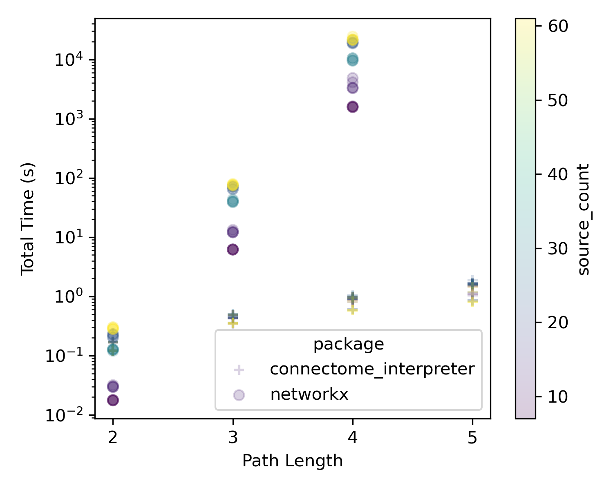

Path finding 
============

After calculating the overall influence from source neurons to target neurons, the next natural question is: *what are the paths between them?*

First, we need to determine the **distances** from which source neurons exert their influence. The :py:func:`contribution_by_path_lengths` function answers this, with :py:func:`contribution_by_path_lengths_heatmap` providing a heatmap visualization.

Once significant path lengths are identified, the :py:func:`find_path_iteratively` function locates paths between source and target neurons (**Figure 1**): Starting from the target neurons at the end of the path (of length `n`), we trace one step upstream (with a threshold) using direct connections in the connectome. We then check if these upstream partners are also "effectively" connected to the source neurons with length `n-1`. We intersect these two sets: 

1. neurons directly connected to the target neurons, and 
2. neurons connected to the source neurons through compressed paths. 

This process is repeated until we reach the source neurons.

The :py:func:`find_path_iteratively` function returns a dataframe of edges, which can be

1. grouped with :py:func:`group_paths` and 
2. filtered using :py:func:`filter_paths` based on thresholds or necessary intermediate neurons, and 
3. plotted with :py:func:`plot_layered_paths`. 

   Figure 1. Path finding. To find paths between source and target neurons `n` steps away, we start from the target neuron(s) (blue outline), and trace one step upstream (blue edges). Using the effective connectivity matrices, we identify neurons effectively connected to the source neurons (orange fill). We intersect these sets and use the new "target neurons" to continue upstream until reaching the source neurons.

In the context of **activation maximisation**, while it effectively links (the known) input to (the unknown) target neuron receptive fields, one might still want to identify significant intermediate neurons: Given the output of activation maximisation, :py:func:`activations_to_df` converts the data into a path-like dataframe, with optional activation/connectivity thresholds, grouped by variables of interest (e.g., cell type). To address "off-target" neuron activations (neurons that are active but do not participate in paths from source to target neurons), the :py:func:`remove_excess_neurons` function allows specifying target neurons and identifying only those neurons linking source to target neurons. The results can be plotted with :py:func:`plot_layered_paths`, which can also display neuron activation by colouring the nodes in the plot.

Benchmarking: 
++++++++++++++
To illustrate the speed of this algorithm, we use use the FAFB central brain connectivity matrix and look for paths between sensory neurons and descending neurons. Most of the code is `here <https://colab.research.google.com/drive/1msd8Ww6zPjhWKAg7yJCiLjgBD8hpUEqD?usp=sharing>`_ (though you will likely run out of colab runtime with `networkx` pathfinding). The data was generated by running similar code (available on request) on HPC. 

   Figure 2. Comparing connectome interpreter with `networkx <https://networkx.org/>`_. 
