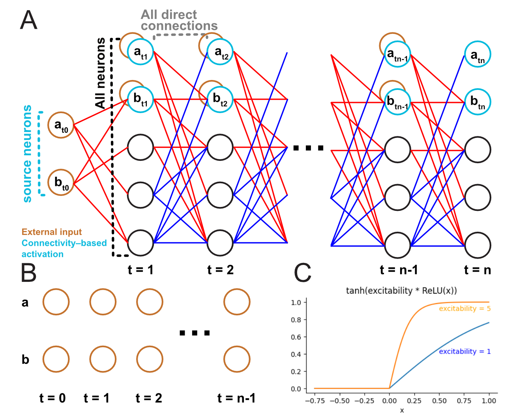

A simplified model of the connectome 
=====================================

Following the thinking process of a "typical neuroscientist", we construct the model with the following assumptions:

- Signals pass in a stepwise manner from one neuron to another through the synapses. So target neurons multiple synaptic hops away are reached later than those one synaptic hop away.
- Excitation and inhibition take the same time to propagate (that is, one step). 
- The activation of a neuron ranges from "not active at all" (0) to "somewhat active" (0~1), to "as active as it can be" (1).

Unlike a "typical neuroscientist", we also make the following assumptions: 

- Neurons are "points". That is, we disregard synapse location, ion channel composition, cable radius etc.. 
- We disregard neuromodulation for now (unless you know what a specific instance of neuromodulation *should* do, in which case you could either model by modifying the connection weights, or ask me to incorporate some new features in the package (`yy432[at]cam.ac.uk <mailto:yy432@cam.ac.uk>`_)). 

With these assumptions, we construct the following model, aiming to provide "connectome-based hypotheses" for your circuit of interest: 

**Panel A** shows the implementation: *all* neurons are in *each* layer. Signed weights between adjacent layers are defined by the connectome. Each layer is therefore like a timepoint. 

User can define a set of source neurons (blue/brown circles) which could be e.g. input to the central brain (sensory neurons, visual projection neurons, ascending neurons). External input is provided by activating the source neurons (brown / **Panel B**). The network is silent before any external input is fed in. 

**Panel C** shows the activation function of each neuron: the (signed) weighted sum of the upstream neurons' activity (x) is passed into a Rectified Linear Unit (`ReLU()`), scaled by `excitability`, and then passed into `tanh()`, to keep the activation of each neuron between 0 and 1. 

An example implementation can be found `here <https://colab.research.google.com/drive/1_beqiKPX8pC7---DWepKO8dEv1sJ2vA4#scrollTo=LAt4e4SPZDxK>`_, which uses the :py:func:`MultilayeredNetwork`. 

Comparison with :doc:`"effective connectivity"<matmul>` 
--------------------------------------------------------
Pros 
+++++
- nonlinearity (i.e. the curvature in **panel C**) - a bit more similar to real neurons; 
- users can see directly the response from a user-defined input pattern (**panel B**); 
- cheaper to compute than "effective connectivity"; 
- neuron activation don't diminish with the increase in layers / time points, which does happen for "effective connectivity" calculation; 
- almost forces users to not cherry pick neurons/connections for interpretation in the densely-connected connectome.

Cons
+++++
- a bit more complicated; 

Plasticity 
-----------
The connectivity in the connectome between some neurons, e.g. ring neurons and compass neurons, is only a *scaffold* for, instead of a direct reflection of, functional connectivity (`Fisher et al. 2022 <https://www.nature.com/articles/s41586-022-05485-4>`_). We therefore implemented (third-party-dependent) change in weights ("plasticity"), based also on the activation similarity of two groups of neurons (:py:func:`change_model_weights`).