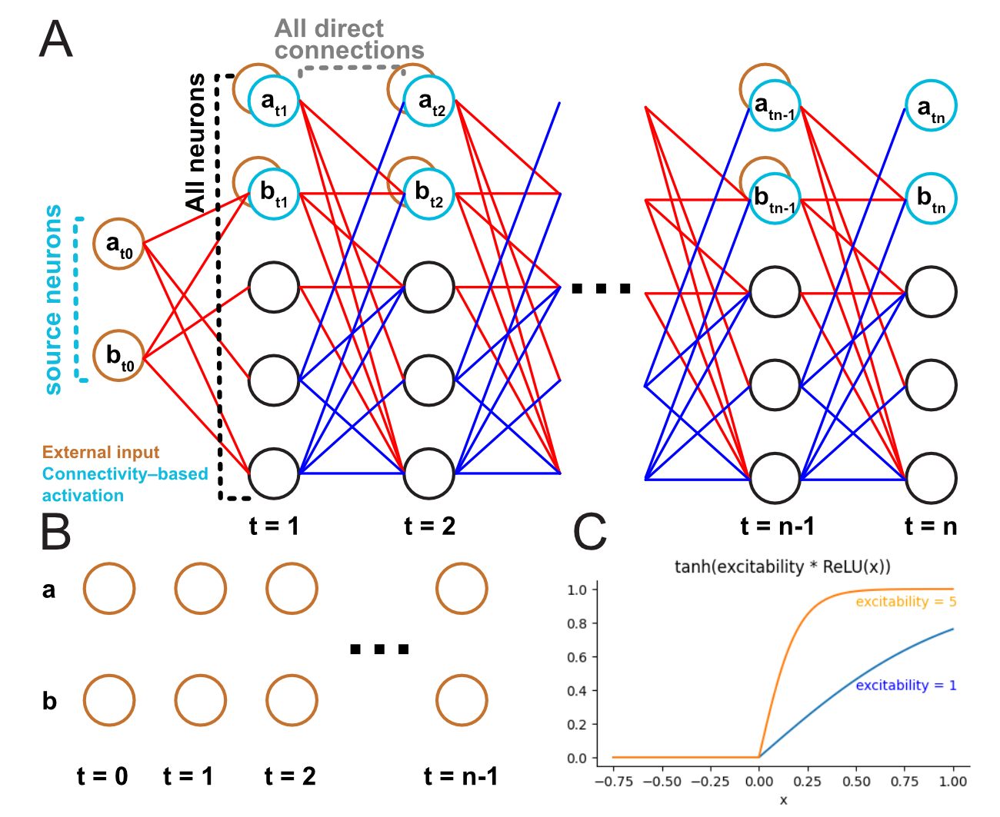

A rate model of the connectome 
=====================================

Following the thinking process of a "typical neuroscientist", we construct a rate model (`Miller & Fumarola 2012 <https://direct.mit.edu/neco/article-abstract/24/1/25/7727/Mathematical-Equivalence-of-Two-Common-Forms-of?redirectedFrom=fulltext>`_) with the following assumptions:

- Signals pass in a stepwise manner from one neuron to another through the synapses. So target neurons multiple synaptic hops away are reached later than those one synaptic hop away.
- Excitation and inhibition take the same time to propagate (that is, one step). 
- The activation of a neuron ranges from "not active at all" (0) to "somewhat active" (0~1), to "as active as it can be" (1).

Unlike a "typical neuroscientist", we also make the following assumptions: 

- Neurons are "points". That is, we disregard synapse location, ion channel composition, cable radius etc.. 
- We disregard neuromodulation for now (unless you know what a specific instance of neuromodulation *should* do, in which case you could either model by modifying the connection weights, or ask me to incorporate some new features in the package (`yy432[at]cam.ac.uk <mailto:yy432@cam.ac.uk>`_)). 

With these assumptions, we construct the following model, aiming to provide "connectome-based hypotheses" for your circuit of interest: 

**Panel A** shows the implementation: *all* neurons are in *each* layer. Signed weights between adjacent layers are defined by the connectome. Each layer is therefore like a timepoint. 

User can define a set of source neurons (brown circles) which could be e.g. input to the central brain (sensory neurons, visual projection neurons, ascending neurons). External input is provided by activating the source neurons at any timepoint (**Panel B**). The network is silent before any external input is fed in. 

**Panel C** illustrates the role of the excitability parameter :math:`\beta`, which controls the steepness of each neuron's activation curve. The full update used in :py:class:`MultilayeredNetwork` is:

.. math::
    r_i(t+1) = \frac{\tau - 1}{\tau}\, r_i(t) + \frac{1}{\tau} \tanh\!\Big(\big[\,\beta_i \sum_j w_{j,i}\, r_j(t) + I_i\,\big]_+\Big)

where :math:`w_{j,i}` is the signed connection weight from neuron :math:`j` to :math:`i`; :math:`\beta_i` scales the total weighted input (the excitability); :math:`I_i` is a bias reflecting baseline activity; :math:`[\,\cdot\,]_+` is a (thresholded) ReLU, which keeps activations non-negative; and :math:`\tau \geq 1` is a time constant controlling how much activation persists across timesteps (:math:`\tau = 1` means the new activation depends only on the current input). Defaults for :math:`\beta`, :math:`I` and :math:`\tau` apply to all neurons, but values can be set per neuron group (e.g. per cell type) via dictionaries.

An example implementation can be found `here <https://colab.research.google.com/drive/1_beqiKPX8pC7---DWepKO8dEv1sJ2vA4#scrollTo=LAt4e4SPZDxK>`_, which uses :py:class:`MultilayeredNetwork`. 

Divisive normalisation 
-----------------------
By default, inhibitory input subtracts from the weighted sum. Selected inhibitory connections can instead act *divisively*: the pre-synaptic activity rescales the post-synaptic neuron's slope :math:`\beta`, reducing its gain rather than shifting its input. This is specified via ``divisive_normalization`` (a dict mapping pre-synaptic groups to lists of post-synaptic groups) and ``divisive_strength``.

Training 
---------
Since the model is differentiable, its parameters (:math:`\beta`, :math:`I`, :math:`\tau`, and optionally connection weights) can be fit to data with :py:func:`train_model`. Parameter sharing within groups applies during training too, so neurons in the same group end up with the same fitted values. Targets can be full time-series activations, or a single average activation per neuron.

Stimulus constructors 
----------------------
- :py:func:`looming_stimulus` generates a visual looming stimulus based on hex coordinates; 
- :py:func:`make_sine_stim` generates sine-shaped stimuli which could be used for central-complex-related studies; 
- :py:func:`load_dataset` loads a number of (primarily olfactory) datasets of neuron activities recorded from experiments.

Comparison with :doc:`"effective connectivity"<matmul>` 
--------------------------------------------------------
Pros 
+++++
- nonlinearity (i.e. the curvature in **panel C**) - a bit more similar to real neurons; 
- users can see directly the response from a user-defined input pattern (**panel B**); 
- cheaper to compute than "effective connectivity"; 
- neuron activation don't diminish with the increase in layers / time points, which does happen for "effective connectivity" calculation; 
- almost forces users to not cherry pick neurons/connections for interpretation in the densely-connected connectome.

Cons
+++++
- a bit more complicated;